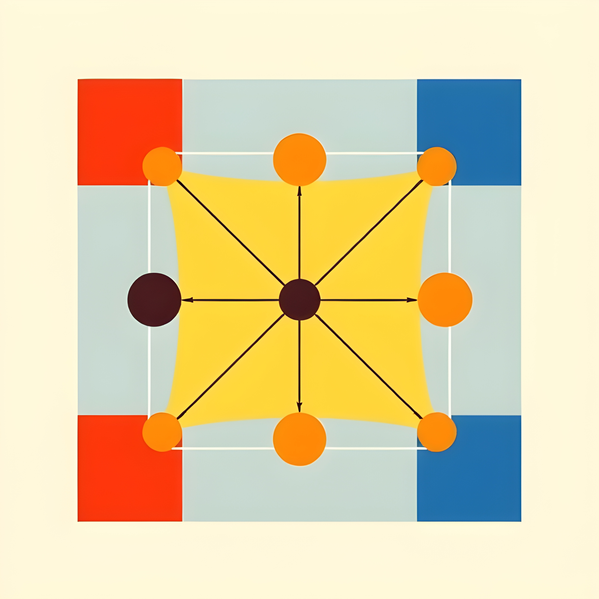

<h1 align="center">Bitcoin-Musig-L</h1>

Introducing lattice-based multi-signature into bitcoin core

  

> Warning: Bitcoin-Musig-L is under active development and the API is subject to change. Do not use in production (**at all, yet**).

- [MuSig-L: Lattice-Based Multi-Signature With Single-Round Online Phase](https://eprint.iacr.org/2022/1036.pdf)

